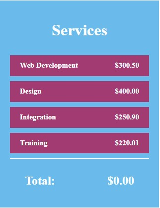

# 23-Angular-Services-App

Testing how the Angular framework works, I created an app that changes states using services.

If you're interested, you can download the repository and open it in your code editor.
Then, run the following commands: `cd .\services-app\`, `npm i`, and `ng serve --open`.

##Preview

